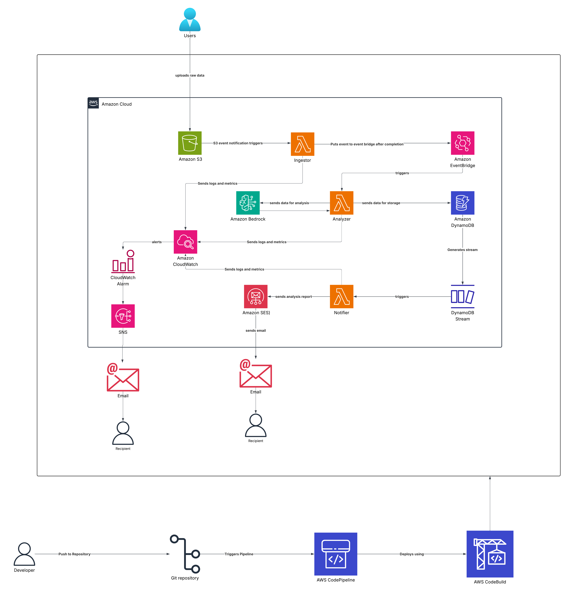
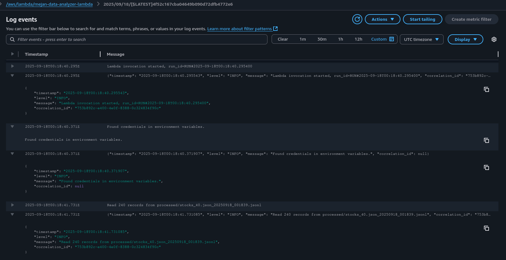
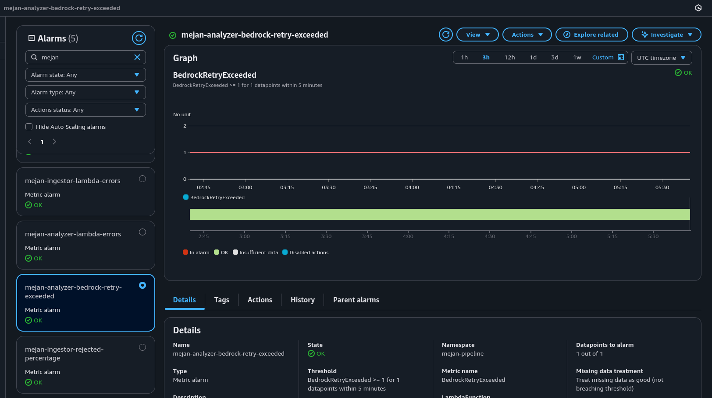
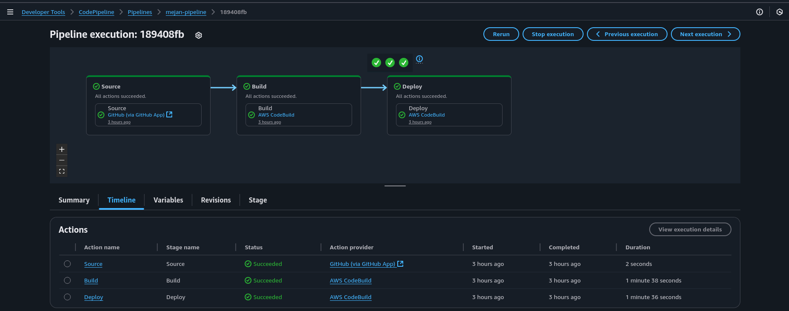
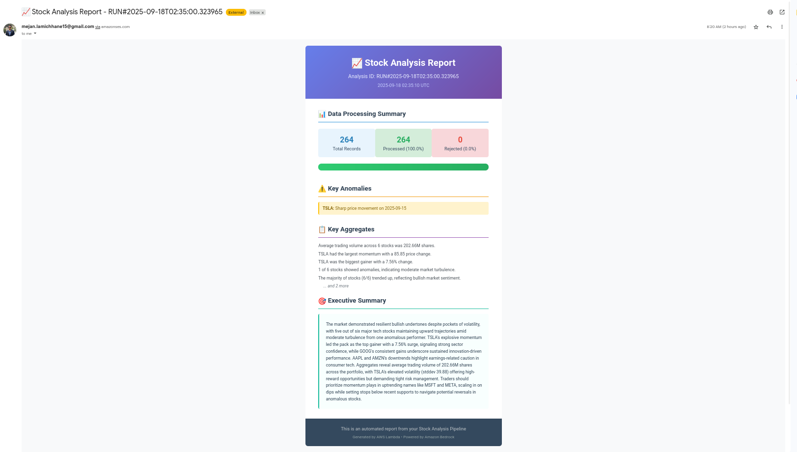
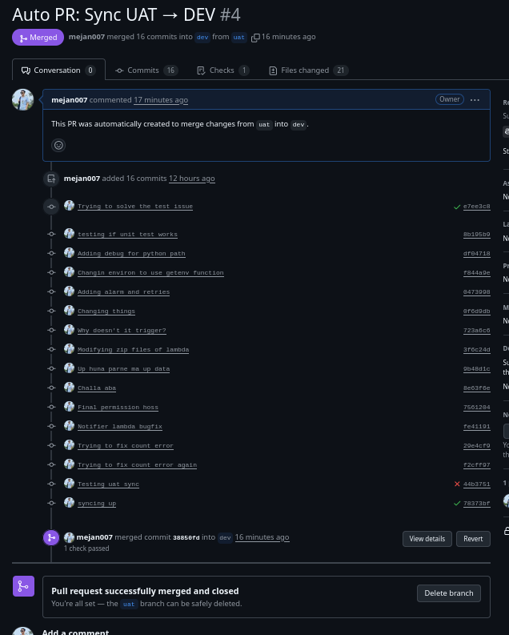

# Serverless Assignment

What is Serverless?

---

# Architecture



---

# Setup Guide

##### Clone the repository to your local machine.

```
git clone git@github.com:mejan007/Serverless-ci-cd.git

cd Serverless-ci-cd
```

##### Configure AWS CLI with appropriate credentials and region

```
aws configure
```

##### [Install terraform](https://developer.hashicorp.com/terraform/tutorials/aws-get-started/install-cli) according to your OS


##### Create a CodeStar Connection

###### Open the AWS Console
- Navigate to Developer Tools → CodeStar Connections or directly visit: AWS CodeStar Connections
###### Create a new connection
- Click Connect to GitHub.
###### Authorize AWS
- Authorize AWS to access your repositories.

- Select the repository you want AWS to access.

###### Name your connection

- Give it a meaningful name, e.g., serverless-ci-cd-connection.

###### Verify the connection

After creation, the connection status should be Available.

CLI command:
```bash
aws codestar-connections list-connections \
  --query "Connections[*].ConnectionArn" \
  --output text
```

Copy the Connection ARN, you will need it in Terraform or CodePipeline setup.

##### Initialize terraform, validate and plan

```
terraform init
terraform validate
terraform plan -out=tfplan
```

##### Before applying, make sure you have sender and receiver email addresses ready which are verified 

```
aws sesv2 get-email-identity --email-identity example@gmail.com
```


##### Apply the Terraform plan to create the CodePipeline.
```
terraform apply tfplan -auto-approve
```

##### Once the pipeline is created, it will automatically deploy the infrastructure code from the infrastructure/  directory.

##### After the pipeline completes successfully, the infrastructure will be set up and ready to use.

##### Visit [twelvedata](https://twelvedata.com/stocks) and get it's api key

##### Create a python virtual environment and run the following code:

```
python3 -m venv serverless-env

source serverless-env/bin/activate

pip install requests python-dotenv boto3
```

##### Create a .env file in the project root with your API key and S3 bucket name:

```
TWELVEDATA_API_KEY=your_api_key_here
RAW_BUCKET=your_bucket_name_here
```

##### To use the api and upload the data to the s3 bucket:

```
python3 upload.py
```

---

## Data Ingestion

### Dataset
The dataset is an OHCV stock data of companies of US taken from [twelvedata](https://twelvedata.com/stocks). 

```json
{
  "AAPL": {
    "meta": {
      "symbol": "AAPL",
      "interval": "1week",
      "currency": "USD",
      "exchange_timezone": "America/New_York",
      "exchange": "NASDAQ",
      "mic_code": "XNGS",
      "type": "Common Stock"
    },
    "values": [
      {
        "datetime": "2025-09-15",
        "open": "237",
        "high": "241.22000",
        "low": "235.029999",
        "close": "239.48",
        "volume": "106792214"
      },
      {
        "datetime": "2025-09-08",
        "open": "239.30000",
        "high": "240.14999",
        "low": "225.95000",
        "close": "234.070007",
        "volume": "304787000"
      },

     ],
    "status": "ok"
  },
  "GOOG": {
    "meta": {
      "symbol": "GOOG",
      "interval": "1week",
      "currency": "USD",
      "exchange_timezone": "America/New_York",
      "exchange": "NASDAQ",
      "mic_code": "XNGS",
      "type": "Common Stock"
    },
    "values": [
      {
        "datetime": "2025-09-15",
        "open": "245.14000",
        "high": "253.23000",
        "low": "244.98000",
        "close": "249.59",
        "volume": "54825834"
      },
      {
        "datetime": "2025-09-08",
        "open": "235.78999",
        "high": "242.57001",
        "low": "233.38000",
        "close": "241.38000",
        "volume": "101818900"
      },
      {
        "datetime": "2025-09-01",
        "open": "208.99001",
        "high": "236.13000",
        "low": "206.96001",
        "close": "235.17000",
        "volume": "159474100"
      },
    ]
   }
}
```


The `json` data is manually ingested to the desired s3 bucket's `inputs/` folder which triggers the pipeline.


### Data Ingestor Lambda

[Source file](infra/modules/ingestor/src/data_ingestor.py)
The Data Ingestor Lambda serves as the entry point of the serverless data pipeline. When a file is uploaded to the `inputs/` folder, this Lambda validates the data, separates valid records from invalid ones, and stores them in appropriate S3 locations.

The `validate_record()` function checks each stock record for required fields like datetime, open, high, low, close, and volume prices. It ensures data types are correct and performs basic sanity checks on OHLC values. The `process_stock_data()` function orchestrates the validation process, flattening the nested JSON structure and collecting valid and invalid records separately.

To prevent duplicate processing, the Lambda uses S3 ETag-based deduplication through marker files stored in the `processed/hashes/` prefix. The `write_to_s3()` function handles output operations, writing valid records to the `processed/` folder and rejected records to the `rejects/` folder in JSON Lines format.

The main `lambda_handler()` coordinates the entire process, from downloading the input file to publishing CloudWatch metrics about rejection rates under the `mejan-pipeline` namespace. Upon successful processing, it publishes an `IngestorCompleted` event to EventBridge to trigger downstream components like the analyzer Lambda.

The Lambda implements comprehensive error handling and structured JSON logging with correlation IDs for traceability across the pipeline. All operations are designed to be idempotent, using timestamp-based naming for output files to handle retries gracefully.

#### Idempotency

## Data Analyzer Lambda

Triggered by EventBridge events from the ingestor, this Lambda performs statistical computations, detects anomalies, and uses Amazon Bedrock to produce actionable trading insights.

The analyzer begins with the `compute_metrics()` function which calculates key financial indicators:

- Trend direction
- Momentum over recent periods
- Volatility using standard deviation 
- Percentage changes

It also identifies anomalies such as unusual trading volumes exceeding 1.5 times the average or sharp price movements beyond 5% thresholds. The `compute_aggregates()` function synthesizes market-wide statistics across all symbols, determining overall market sentiment, identifying top gainers and losers, and summarizing turbulence levels.

The core intelligence comes from `call_bedrock()` which constructs detailed prompts for the Amazon **Nova Lite** model, requesting both per-symbol analysis and executive summaries. The function implements retry logic with up to 5 attempts and publishes CloudWatch metrics when retry limits are exceeded.

Results are persisted through `store_analysis()` which writes analysis results to the DynamoDB table specified by the `TABLE_NAME` environment variable. The stored records include symbol insights, aggregate statistics, executive summaries, and row count metadata from the original ingestor processing. 


### Cost Breakdown and comparison

#### Current Pricing Structure

**Amazon Nova Lite**
- Input tokens: $0.00006 per 1,000 tokens
- Output tokens: $0.00024 per 1,000 tokens
- Context window: 300K tokens

### Competitive Comparison

| Model | Input Cost (per 1K tokens) | Output Cost (per 1K tokens) | Cost Advantage |
|-------|---------------------------|----------------------------|---------------|
| **Amazon Nova Lite** | $0.00006 | $0.00024 | **Baseline** |
| Claude 3.5 Haiku | $0.0008 | $0.0004 | 5.0× cheaper overall |
| Claude 3 Haiku | $0.025 | $0.125 | ~13× cheaper for input, ~2× more expensive for output |
| GPT-4o Mini | $0.15 | $0.60 | ~2.5× cheaper for input, ~2.5× cheaper for output |
| Gemini 1.5 Flash | $0.075 | $0.30 | ~1.25× cheaper for input, ~1.25× cheaper for output |


#### Estimated Usage per Analysis Run:

**Input Token Breakdown:**
- Base prompt instructions: ~800 tokens
- Aggregates section: ~200-400 tokens (depending on number of symbols)
- Per-symbol data section: ~300-500 tokens per symbol
- OHLCV data points: ~50-100 tokens per data point (up to 52 points per symbol)
- **Total Input**: 3,000-8,000 tokens (varies by number of symbols and data history)

**Output Token Breakdown:**
- Executive summary (150-250 words): ~200-350 tokens
- Per-symbol analysis (4 fields × 1-3 sentences each): ~150-250 tokens per symbol
- JSON structure overhead: ~50-100 tokens
- **Total Output**: 1,000-2,000 tokens (for 3-6 symbols typical)

**Monthly Cost Scenarios:**

| Scenario | Runs/Day | Input Tokens | Output Tokens | Nova Lite Cost | Claude 3.5 Haiku Cost | Monthly Savings |
|----------|----------|--------------|---------------|----------------|-------------------|----------------|
| Light Usage (2-3 symbols) | 5 | 4,000 | 1,200 | $0.22 | $2.44 | $2.22 (91% savings) |
| Moderate Usage (4-5 symbols) | 20 | 6,000 | 1,600 | $1.33 | $14.72 | $13.39 (91% savings) |
| Heavy Usage (6+ symbols) | 100 | 8,000 | 2,000 | $6.60 | $73.20 | $66.60 (91% savings) |

**Annual Cost Projection:**
- Nova Lite (moderate usage): ~$16.00
- Claude 3.5 Haiku (moderate usage): ~$177.00
- **Annual savings: $161.00 (91% cost reduction)**


## Notifier Lambda

The Email Notifier Lambda completes the pipeline by sending formatted analysis reports via **Amazon SES** whenever new analysis data is written to DynamoDB. Triggered by **DynamoDB Streams** on `INSERT` events, this Lambda transforms the stored analysis into professional HTML email reports for stakeholders.

Each successful analysis triggers an immediate email notification with correlation IDs for complete pipeline traceability. 

# CI-CD Pipeline

The CI/CD implementation follows a two-stage approach using AWS CodeBuild with separate buildspecs for Continuous Integration (CI) and Continuous Deployment (CD).

### Continuous Integration Pipeline (`buildspec_ci.yaml`)

```yml
version: 0.2

phases:
  install:
    runtime-versions:
      python: 3.12
    commands:
      - echo "Installing OS dependencies..."
      - yum install -y make zip unzip wget || true
      - echo "Installing terraform..."
      - wget https://releases.hashicorp.com/terraform/1.13.1/terraform_1.13.1_linux_amd64.zip
      - unzip terraform_1.13.1_linux_amd64.zip -d /usr/local/bin/
      - terraform -version
      - python3 --version
      - echo "Installing Python dependencies..."
      - pip3 install --upgrade pip
      - pip3 install -r requirements.txt
  
  pre_build:
    commands:
      - echo "Setting up PYTHONPATH..."
      - export PYTHONPATH=$PYTHONPATH:$CODEBUILD_SRC_DIR
      - echo "Listing files for debugging..."
      - ls -R $CODEBUILD_SRC_DIR
      - echo "Running python unit tests...."
      - pytest tests/test_analyzer.py --junitxml=test-results/results.xml

  
  build:
    commands:
      - echo "Initializing terraform...."
      - cd infra
      - terraform init -input=false -upgrade
      - echo "Running terraform validate....."
      - terraform fmt -recursive
      - terraform validate

artifacts:
  files:
    - '**/*'
  discard-paths: no
  exclude-paths:
    - '.terraform/**'

cache:
  paths:
    - '/root/.cache/pip/**/*'
    - 'infra/.terraform/**/**'
```

The CI pipeline focuses on validation and testing. The install phase sets up the build environment by installing Python 3.12 runtime, essential OS dependencies like make and zip utilities, Terraform 1.13.1 and Python dependencies.

In the prebuild phase, the pipeline specifically runs `test_analyzer.py` tests and generates XML reports.

During the build phase, the pipeline runs `terraform fmt` for code formatting consistency and `terraform validate` to catch configuration errors early. 

Terraform state and modules are cached between builds to improve performance, while test artifacts and formatted code are preserved for the deployment stage.

### Continuous Deployment Pipeline (`buildspec_cd.yaml`)

```yaml
version: 0.2

phases:
  install:
    runtime-versions:
      python: 3.12
    commands:
      - echo "Installing OS dependencies..."
      - yum install -y make zip unzip wget awscli || true  # Add AWS CLI for S3 upload
      - echo "Installing Terraform 1.13.1..."
      - wget https://releases.hashicorp.com/terraform/1.13.1/terraform_1.13.1_linux_amd64.zip
      - unzip terraform_1.13.1_linux_amd64.zip -d /usr/local/bin/
      - terraform --version
      - python3 --version
      - echo "Installing Python dependencies..."
      - pip3 install --upgrade pip
      - pip3 install -r requirements.txt  # If needed for Lambda ZIP build


  build:
    commands:
      - echo "Initializing Terraform..."
      - cd infra
      - terraform init -input=false -upgrade
      - echo "Running Terraform plan..."
      - terraform plan -out=tfplan
      - echo "Uploading plan to S3 for review..."
      - aws s3 cp tfplan s3://mejan-pipeline-artifacts/tfplan.binary 
      - echo "Terraform plan uploaded."

  post_build:
    commands:
      - echo "Applying Terraform..."
      - terraform apply -auto-approve -input=false tfplan  # Applies the plan


cache:
  paths:
    - '/root/.cache/pip/**/*'
    - 'infra/.terraform/**/*'
```

The installation phase ensures all necessary tools are available for both Terraform operations and Lambda package deployment.

After initialization, `terraform plan` generates an execution plan that gets uploaded to the `mejan-pipeline-artifacts` S3 bucket for review and audit purposes.

The post_build phase applies `terraform apply` using the `-auto-approve` flag. The pipeline uses the specific plan file generated in the build phase, ensuring consistency.

# Git-back sync

```yaml

name: Auto PR from UAT to DEV

on:
  push:
    branches:
      - uat

jobs:
  create-pr:
    runs-on: ubuntu-latest

    steps:
      - name: Checkout repo
        uses: actions/checkout@v4
        with:
          fetch-depth: 0

      - name: Set up GitHub CLI
        run: |
          sudo apt-get install gh

      - name: Configure Git
        run: |
          git config --global user.email "github-actions[bot]@users.noreply.github.com"
          git config --global user.name "github-actions[bot]"

      - name: Check for commits to merge
        id: check_diff
        run: |
          git fetch origin dev
          COMMITS=$(git rev-list --count origin/dev..origin/uat)
          echo "Found $COMMITS unmerged commits"
          echo "commits=$COMMITS" >> $GITHUB_OUTPUT

      - name: Create Pull Request
        if: steps.check_diff.outputs.commits != '0'
        env:
          GH_TOKEN: ${{ secrets.PAT_GITHUB }}
        run: |
          gh pr create \
            --base dev \
            --head uat \
            --title "Auto PR: Sync UAT → DEV" \
            --body "This PR was automatically created to merge changes from \`uat\` into \`dev\`."

```
The Git back sync addresses branch divergence by automatically syncing UAT changes back to development.

The workflow checks for unmerged commits between development and UAT branches using **Git revision counting**. When differences are detected, it automatically creates a pull request from UAT to development using GitHub CLI and a Personal Access Token.

This approach maintains visibility through manual PR review while automating the detection process.


---

# Structured Logging

```python
class JSONFormatter(logging.Formatter):
    def format(self, record):
        log_entry = {
            "timestamp": datetime.datetime.utcnow().isoformat(),
            "level": record.levelname,
            "message": record.getMessage(),
            "correlation_id": getattr(record, "correlation_id", None),
        }
        return json.dumps(log_entry)

logger = logging.getLogger()
logger.setLevel(logging.INFO)
handler = logging.StreamHandler()
handler.setFormatter(JSONFormatter())
logger.addHandler(handler)

```

The pipeline implements structured JSON logging across all Lambda functions to enable efficient log analysis and debugging in CloudWatch. 

The `JSONFormatter` class converts Python log records into structured JSON format with consistent fields including timestamp, log level, message, and correlation ID. Each log entry becomes a parseable JSON object rather than free-form text, enabling CloudWatch Insights queries and automated log processing. The correlation ID field provides end-to-end traceability across the entire pipeline

---


# Screenshots

## S3 bucket

## Logs



## Alarms


## CI-CD Pipeline



## Analysis report


## Git-back sync




<!-- ## S3 lifecyle -->

